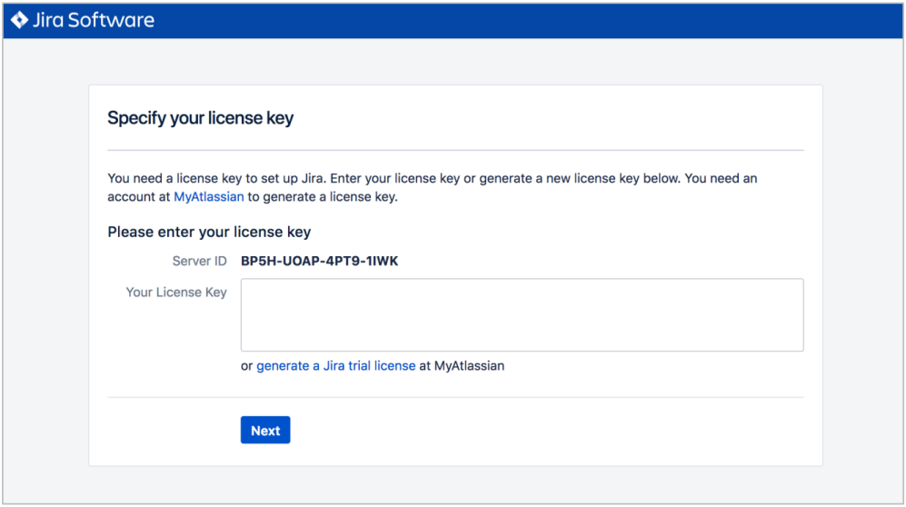
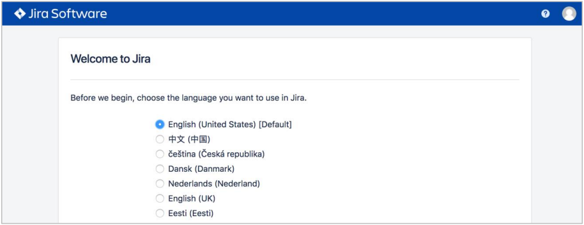
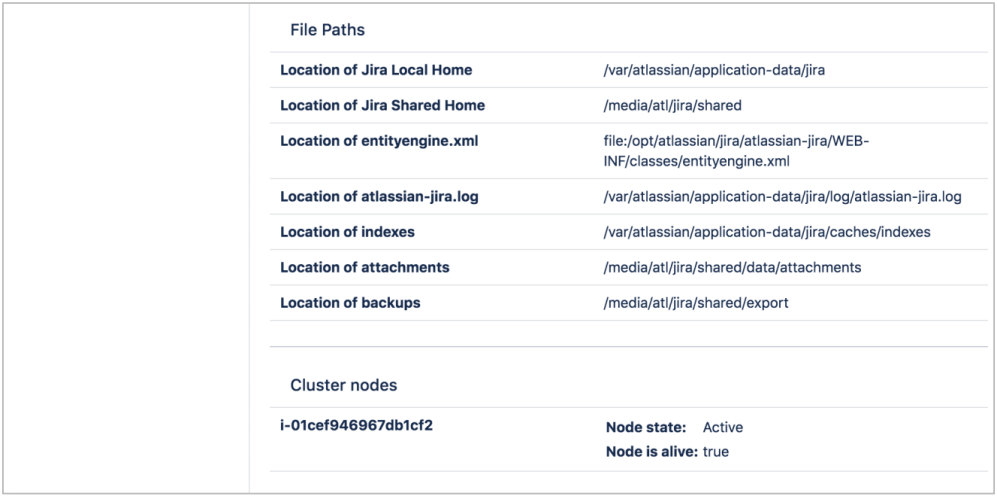

. Choose the URL that is displayed in the *Outputs* tab of the AWS CloudFormation stack to go to the {partner-product-short-name} configuration page.
+
IMPORTANT: If you get an https://confluence.atlassian.com/kb/network-and-connectivity-troubleshooting-guide-720405335.html[HTTP Error 503] response when you access the URL, it means that {partner-product-short-name} is still loading. This is expected, and you should wait a couple of minutes before trying again.
. On the *Setup application properties* page, enter a title for your Jira application deployment, choose the *Mode* you want, leave the base URL unchanged, and then choose *Next*.
+
.Setting up properties
image::../images/qs-jira-step2-setup-app-properties.png[width=640]
. On the *Specify your license key* page, enter a valid Jira Software or Service Management Data Center license key. If you don’t have a valid license for the Jira application you’ve selected to deploy, choose *generate a Jira trial license* and sign up for an evaluation Data Center license.
+
.Jira licensing

. To set up the Jira application, you need to create an Administrator account and password. The Administrator account has full access to all data in Jira, so we highly recommend that you choose a strong password for this account. Enter the Administrator’s user details in the setup screen (Figure 5), and then choose *Next*.
+
.Setting up properties
image::../images/qs-jira-step4-setup-admin-account.png[width=640]
. On the *Set up email notifications* page, choose *Later*, and then choose *Finish*.
+
.Email notifications page
image::../images/qs-jira-step5-setup-email-notifications.png[width=640]
. In the first *Welcome to Jira* page, choose a language and then choose *Continue*.
+
.Choosing a language

. In the second *Welcome to Jira* page, choose an avatar for your profile, if you wish, and then choose *Next*.
+
.Choosing an avatar
image::../images/qs-jira-step7-choose-avatar.png[width=640]
. On the next *Welcome* page, choose *Create sample project*, and enter a name for the project.
. Choose *Settings* (the gear icon in the upper right), and then choose *System*. You should see a page similar to the one below.
+
.Viewing systemm info
image::../images/qs-jira-step9-view-system-info.png[width=640]
. Scroll down to the *Cluster Nodes* section. You should see your current node in the *Active* state.
+
.Viewing cluster nodes

